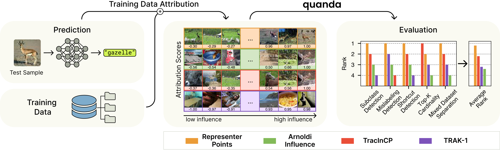
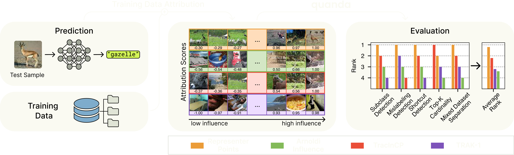
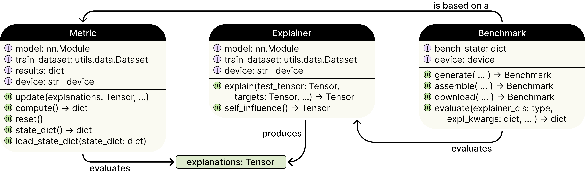
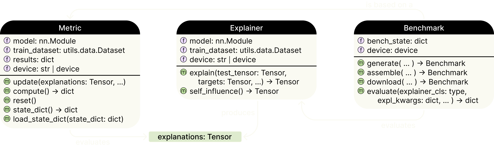

Welcome to |quanda|'s documentation!
==================================
|quanda| is a toolkit for **quan**\ titative evaluation of **d**\ ata **a**\ ttribution methods in **PyTorch**.

.. note::
    |quanda| is currently in development. We are actively working on expanding the library and improving the documentation. If you have any questions, please `open an issue <https://github.com/dilyabareeva/quanda/issues/new/choose>`_ or write us at dilyabareeva@gmail.com or galip.uemit.yolcu@hhi.fraunhofer.de.

   `Fig. 1:` |quanda| `provides a unified and standardized framework to evaluate the quality of Training Data Attribution methods in different contexts and from different perspectives.`

   `Fig. 1:` |quanda| `provides a unified and standardized framework to evaluate the quality of Training Data Attribution methods in different contexts and from different perspectives.`

.. note::
    This page describes |quanda|'s purpose, design and features. For a quick start on |quanda|, please refer to the :doc:`Quickstart <./quickstart>` page.

Training Data Attribution (TDA) is a new avenue in the interpretation of neural networks. While some methods attempt to estimate the counterfactual effects of training new models on the subsets of the training dataset, this ground truth is noisy and hard to compute. Therefore, the community has proposed evaluating these methods' performance on a downstream task, or measuring how well a method satisfies desired heuristic properties.

|quanda| is designed to meet the need of a comprehensive and systematic evaluation framework, as well as a unified interface for attributors. Please visit the :doc:`Background <./background>` page for a detailed explanation of TDA, including citations to the relevant literature.

Library Features
----------------
Here we list the main components of |quanda| along with basic explanations of their function. We refer the reader to the :doc:`contribution guide <./contributing>`, the :doc:`API reference <docs_api/modules>` and the :ref:`Basic Usage <quickstart:basic usage>` for further details. Below is a schematic representation of the components of |quanda|:

   `Fig. 2: Components and their interactions in` |quanda|

   `Fig. 2: Components and their interactions in` |quanda|

.. raw:: html

   

<b><big>Explainers</big></b>

|quanda| provides a unified interface for various TDA methods, symbolized by the :doc:`Explainer <docs_api/quanda.explainers.base>` base class. The interface design prioritizes ease of use and easy extensions, allowing users to quickly wrap their implementations to use within |quanda|.

.. raw:: html

   

.. raw:: html

   

<b><big>Metrics</big></b>

|quanda| provides a set of metrics to evaluate the effectiveness of TDA methods. These metrics are based on the latest research in the field. Most :doc:`Metric <docs_api/quanda.metrics.base>` objects in |quanda| are used to compute the evaluation scores from attributions over a test set. The :doc:`Metric <docs_api/quanda.metrics.base>` objects are designed to be easily extendable, allowing users to define their own metrics.

.. raw:: html

   

.. raw:: html

   

<b><big>Benchmarks</big></b>

Note that many metrics require training models in controlled settings, e.g. with mislabeled samples that are known. This means that the corresponding :doc:`Metric <docs_api/quanda.metrics.base>` objects can only be used if the user has prepared this controlled setup. Furthermore, :doc:`Metric <docs_api/quanda.metrics.base>` objects require generating the attributions beforehand. |quanda| provides a benchmarking tool to evaluate the performance of TDA methods on a given model, dataset and problem. For each :doc:`Metric <docs_api/quanda.metrics.base>` object, |quanda| provides a :doc:`Benchmark <docs_api/quanda.benchmarks.base>` object. The :doc:`Benchmark <docs_api/quanda.benchmarks.base>` objects handle the creation of the controlled setup, training the model, generating the attributions and evaluating them using the corresponding :doc:`Metric <docs_api/quanda.metrics.base>` object, if needed. Finally, we provide precomputed benchmarks, which can be used by initializing the object with the ``load`` method. These precomputed benchmarks allow the user to skip the creation of the controlled setup to directly start the evaluation process, while providing a standard benchmark for practitioners and researchers to compare their methods with.

.. raw:: html

   

Supported TDA Methods
---------------------
.. list-table::
   :header-rows: 1

   * - Method
     - Repository
     - Reference
     - Description
   * - Similarity Influence
     - `Captum <https://github.com/pytorch/captum/tree/master>`_
     - `Caruana et al., 1999 <https://captum.ai/api/influence.html#similarityinfluence>`_
     - Ranks the training samples based on their similarity to the test sample
   * - Arnoldi Influence Functions
     - `Captum <https://github.com/pytorch/captum/tree/master>`_
     - `Schioppa et al., 2022 <https://arxiv.org/abs/2112.03052>`_
     -  Estimates LOO effects, following (`Koh and Liang, 2017 <https://proceedings.mlr.press/v70/koh17a.html>`_)
   * - TracIn
     - `Captum <https://github.com/pytorch/captum/tree/master>`_
     - `Pruthi et al., 2020 <https://proceedings.neurips.cc/paper/2020/hash/e6385d39ec9394f2f3a354d9d2b88eec-Abstract.html>`_
     - Tracks the contribution of training points in the loss reduction throughout training, via a linear approximation
   * - Representer Point Selection
     - `Representer Point Selection <https://github.com/chihkuanyeh/Representer_Point_Selection>`_
     - `Yeh et al., 2018 <https://proceedings.neurips.cc/paper/2018/hash/8a7129b8f3edd95b7d969dfc2c8e9d9d-Abstract.html>`_
     - Trains the model with L2 regularization on the final layer, which produces an interpretable surrogate model
   * - TRAK
     - `TRAK <https://github.com/MadryLab/trak>`_
     - `Park et al., 2023 <https://proceedings.mlr.press/v202/park23c.html>`_
     - Uses an empirical Neural Tangent Kernel surrogate model for which a theoretical TDA formula exists

Evaluation Metrics
------------------
In this section, we list the evaluation criteria that are currently available in |quanda|.

.. list-table::
  :header-rows: 1

  * - Name
    - Reference
    - Description
    - Type
  * - Linear Datamodeling Score
    - `Park et al., 2023 <https://proceedings.mlr.press/v202/park23c.html>`_
    - Measures the correlation between the (grouped) attribution scores and the actual output of models trained on different subsets of the training set. For each subset, the linear datamodeling score compares the actual model output with the sum of attribution scores from the subset using Spearman rank correlation.
    - Ground Truth
  * - Identical Class / Identical Subclass
    - `Hanawa et al., 2021 <https://openreview.net/forum?id=9uvhpyQwzM_>`_
    - Measures the proportion of identical classes or subclasses in the top-1 training samples over the test dataset. If the attributions are based on similarity, they are expected to be predictive of the class of the test datapoint, as well as different subclasses under a single label.
    - Downstream Task Evaluator
  * - Shortcut Detection
    - `Yolcu et al., 2024 <https://arxiv.org/abs/2402.12118>`_
    - Assuming a known `shortcut <https://www.nature.com/articles/s42256-020-00257-z>`_, or `Clever-Hans <https://www.nature.com/articles/s41467-019-08987-4>`_ effect has been identified in the model, this metric evaluates how effectively a TDA method can identify shortcut samples as the most influential in predicting cases with the shortcut artifact. This process is referred to as **Domain Mismatch Debugging** in the original paper.
    - Downstream Task Evaluator
  * - Mislabeled Data Detection
    - `Koh and Liang, 2017 <https://proceedings.mlr.press/v70/koh17a.html>`_
    - Computes the proportion of noisy training labels detected as a function of the percentage of inspected training samples. The samples are inspected in order according to their global TDA ranking, which is computed using local attributions. This produces a cumulative mislabeling detection curve. We expect to see a curve that rapidly increases as we check more of the training data, thus we compute the area under this curve.
    - Downstream Task Evaluator
  * - Top-K Cardinality
    - `Barshan et al., 2020 <http://proceedings.mlr.press/v108/barshan20a/barshan20a.pdf>`_
    - Measures the cardinality of the union of the top-K training samples. Since the attributions are expected to be dependent on the test input, they are expected to vary heavily for different test points, resulting in a low overlap (high metric value).
    - Heuristic
  * - Model Randomization
    - `Hanawa et al., 2021 <https://openreview.net/forum?id=9uvhpyQwzM_>`_
    - Measures the correlation between the original TDA and the TDA of a model with randomized weights. Since the attributions are expected to depend on model parameters, the correlation between original and randomized attributions should be low.
    - Heuristic
  * - Mixed Datasets
    - `Hammoudeh and Lowd, 2022 <https://dl.acm.org/doi/abs/10.1145/3548606.3559335>`_
    - In a setting where a model has been trained on two datasets: a clean dataset (e.g. CIFAR-10) and an adversarial (e.g. zeros from MNIST), this metric evaluates how well the model ranks the importance (attribution) of adversarial samples compared to clean samples when making predictions on an adversarial example.
    - Heuristic

Benchmarks
----------
|quanda| comes with a few pre-computed benchmarks that can be conveniently used for evaluation in a plug-and-play manner. We are planning to significantly expand the number of benchmarks in the future. The benchmarks currently use the MNIST dataset to conduct evaluations. The following benchmarks are available:

.. list-table::
  :header-rows: 1

  * - Name
    - Metric
    - Type
  * - mnist_top_k_cardinality
    - `TopKCardinalityMetric <docs_api/quanda.metrics.heuristics.top_k_cardinality.html>`_
    - Heuristic
  * - mnist_mixed_datasets
    - `MixedDatasetMetric <docs_api/quanda.metrics.heuristics.mixed_datasets.html>`_
    - Heuristic
  * - mnist_class_detection
    - `ClassDetectionMetric <docs_api/quanda.metrics.downstream_eval.class_detection.html>`_
    - Downstream Task Evaluator
  * - mnist_subclass_detection
    - `SubclassDetectionMetric <docs_api/quanda.metrics.downstream_eval.subclass_detection.html>`_
    - Downstream Task Evaluator
  * - mnist_mislabeling_detection
    - `MislabelingDetectionMetric <docs_api/quanda.metrics.downstream_eval.mislabeling_detection.html>`_
    - Downstream Task Evaluator
  * - mnist_linear_datamodeling_score
    - `LinearDatamodelingMetric <docs_api/quanda.metrics.ground_truth.linear_datamodeling.html>`_
    - Ground Truth

Citation
--------
If you find |quanda| useful and want to use it in your research, please cite it using the following BibTeX entry:

.. code:: bibtex

  @misc{bareeva2024quandainterpretabilitytoolkittraining,
        title={Quanda: An Interpretability Toolkit for Training Data Attribution Evaluation and Beyond},
        author={Dilyara Bareeva and Galip Ümit Yolcu and Anna Hedström and Niklas Schmolenski and Thomas Wiegand and Wojciech Samek and Sebastian Lapuschkin},
        year={2024},
        eprint={2410.07158},
        archivePrefix={arXiv},
        primaryClass={cs.LG},
        url={https://arxiv.org/abs/2410.07158},
  }

If you are using |quanda| for your scientific research, please also make sure to cite the original authors for the implemented metrics and TDA methods.

.. toctree::
   :caption: Usage

   quickstart
   tutorials

.. toctree::
   :caption: API Reference
   :maxdepth: 1

   docs_api/modules

.. toctree::
   :caption: Background

   background
   how_to_evaluate

.. toctree::
   :caption: Community

   contributing

